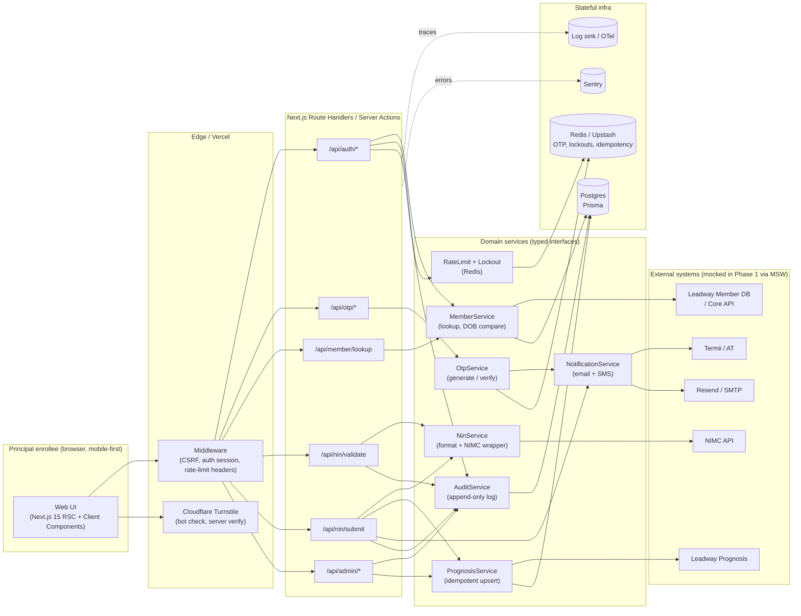
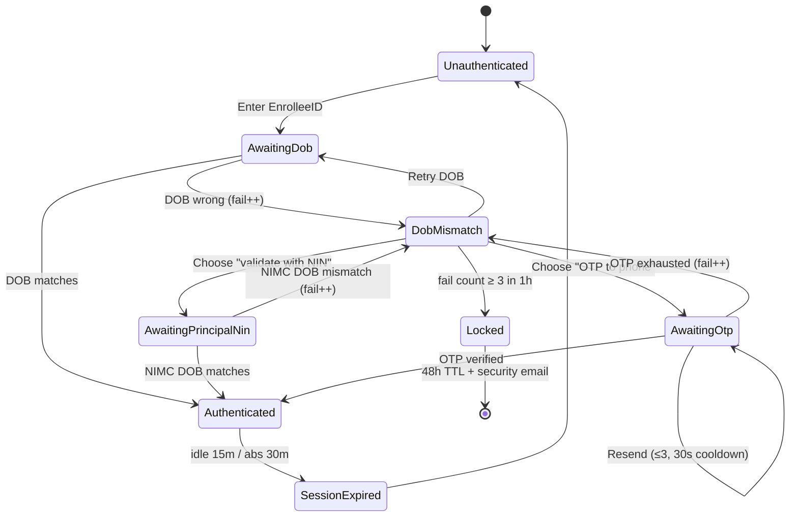
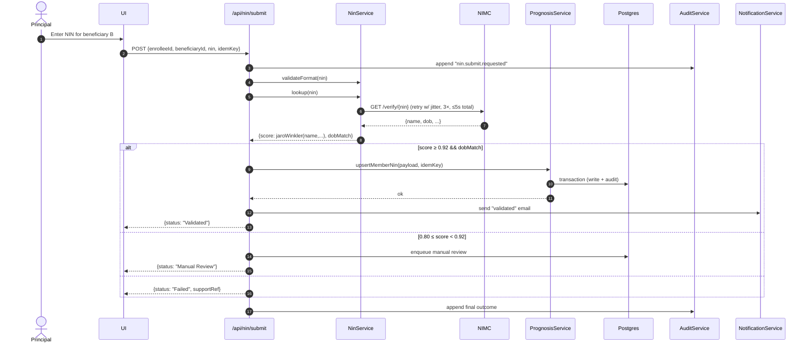

# LWH NIN Verification — Proposed Architecture

Status: **Draft for review** (pre‑Phase‑1). No code is written yet.
All external integrations are **mocked behind TypeScript interfaces** in
Phase 1 per the brief.

---

## 1. High‑level system context

### Why this shape
- **Next.js App Router + Server Actions / Route Handlers** keeps the bot
  surface small (no public GraphQL), centralises auth, and lets us stream
  progress per beneficiary.
- **Domain services with typed interfaces** is the boundary the brief
  mandates (MemberService / NinService / OtpService / PrognosisService /
  NotificationService). Phase 1 implementations are MSW‑backed fakes;
  Phase 2 swaps the impls without touching the UI.
- **Redis for ephemeral state** (OTP codes, 48‑h lockouts, idempotency
  keys, IP rate limits) keeps Postgres transactional surface small.
- **Append‑only audit log in Postgres** with a `traceId` joining every
  sensitive action. 12‑month retention; PII masked at write time.

---

## 2. Auth / lockout state machine

Failure counter key: `lock:{enrolleeId}` in Redis, 1‑hour sliding window.
Lock key: `lock:{enrolleeId}:hard`, 48‑hour TTL. IP throttle key:
`rl:auth:{ip}`, 10/min sliding.

---

## 3. NIN submission sequence (happy path + retry)

Idempotency: the same `idemKey` + `nin` replay returns the original
result without a second NIMC call or a duplicate Prognosis write.

---

## 4. Trust boundaries and PII handling

| Boundary                    | Data in motion                | Protection                                    |
| --------------------------- | ----------------------------- | --------------------------------------------- |
| Browser ⇄ Edge              | Session cookie, form data     | TLS 1.3, HSTS, secure/httpOnly/sameSite=lax  |
| Edge ⇄ Next handlers        | Same                          | CSRF token (double‑submit), Turnstile verify  |
| Handlers ⇄ NIMC             | NIN, DOB                      | mTLS / signed headers (TBC w/ provider)       |
| Handlers ⇄ Prognosis        | memberId, NIN, verifiedName   | Service‑to‑service auth (TBC), mTLS if avail  |
| Handlers ⇄ Postgres         | Encrypted columns (NIN, phone)| AES‑256‑GCM envelope; keys from KMS/env       |
| Logs                        | Never raw NIN/phone/email     | `maskPii()` at the log boundary               |

Encrypted columns: `member.nin`, `member.phone`, `otp.codeHash`,
`audit.payload` (if it may contain PII). Deterministic hash for lookup
keys (`nin_lookup_hash`).

---

## 5. Phase 1 mock strategy (MSW)

- A single `mocks/handlers.ts` wires fake NIMC / Prognosis / Member DB /
  SMS / Email endpoints.
- Scenario cookies (`x-mock-scenario=nimc-timeout` etc.) flip fixtures
  per request so we can exercise every edge case from the brief.
- Deterministic fixtures in `mocks/fixtures/*.ts` include the twelve edge
  cases called out in the spec (zero dependants, NIMC 5xx, married
  surname, diacritics, partial success, OTP expired, locked retry, …).

---

## 6. Observability

- **pino** JSON logs with `traceId`, `sessionId?`, `enrolleeIdHash`,
  `route`, `latencyMs`, `outcome`. PII‑masking helper is the only
  permitted way to include user data in a log line.
- **OpenTelemetry** tracer; spans around every external call
  (NIMC / Prognosis / SMS / email / DB tx).
- **Sentry** for unhandled exceptions; scrubber drops NIN/phone/DOB.

---

## 7. Non‑functional targets traced to design

| Target                                | How met                                        |
| ------------------------------------- | ---------------------------------------------- |
| Auth p95 < 1.5 s                      | Redis‑backed lookups, no external calls on login path |
| NIN validate p95 < 5 s                | 3× retry w/ jitter budget = 4 s; circuit breaker |
| OTP delivery < 30 s                   | Async send, but surface "sent" only after provider 2xx |
| ≥ 80% coverage on services / validation | Isolated pure functions + vitest + fixtures  |
| Session 15 m idle / 30 m absolute     | NextAuth v5 JWT with both TTLs                 |
| Rate limits                           | Upstash Redis sliding-window counters          |

---

## 8. What this design is **not** yet committing to

- The exact NIMC/Prognosis API shapes — placeholders in interfaces
  until docs are received (see `open-questions.md`).
- Choice of KMS (Vercel env vs. AWS KMS vs. Infisical) — depends on
  where we deploy.
- Whether admin console is same app (route group) or a separate one —
  defaulting to a `/admin` route group protected by role.
